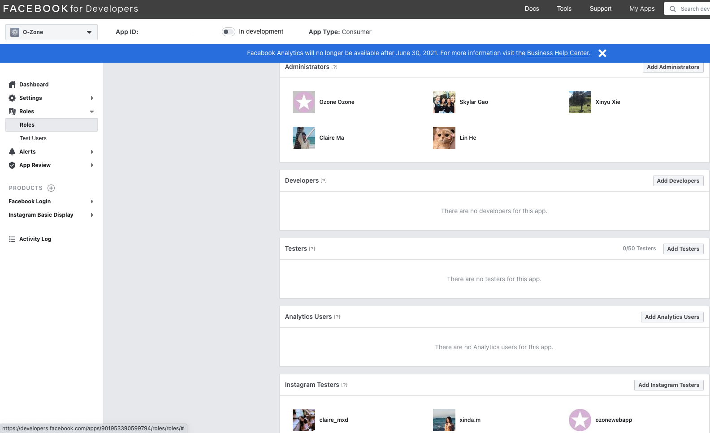

# Instruction on Build

In this project,

-   back-end is written in express.js and lives in the `back-end` directory.
-   front-end is written in react.js and lives in the `front-end` directory.

clone this repository

    git clone https://github.com/agile-dev-assignments/project-setup-team-ikedacho-visionary.git

cd to the cloned directory

    cd project-setup-team-ikedacho-visionary

## Production mode

When env.NODE_ENV is equal to PRODUCTION:

-   server will serve static files in `front-end/build`

cd to back-end directory

    cd back-end

add a `.env` file in the back-end directory

    touch .env

add `NODE_ENV=PRODUCTION` in .env file

save the file

cd to `front-end` directory

    cd ../front-end

install all the dependency in the front-end

    npm install

build react app

    npm run build

cd to `back-end'

    cd ../back-end

install all the dependency in order to launch and run the server.

    npm install

start server

    npm start server

Then open a browser and go to [http://localhost:3000](http://localhost:3000) to see our project locally.

If you are not log in, it will redirect to [http://localhost:3000/prelogin](http://localhost:3000/prelogin) page.

You must log in first to use all functionality of our app.

## When the app is in development mode

When `env.NODE_ENV` is not equal to `PRODUCTION` or if `env.NODE_ENV` does not exist:

-   Server(express app) runs in port 3000.
-   Client(react app) runs in port 4000.

### start server written in express.js in back-end folder

cd to `back-end` directory

    cd back-end

install all the dependency in order to launch and run the server.

    npm install

start the server.

    node server or npx nodemon sever or npm start

### Then start front-end react app in front-end folder:

open another terminal

In the new terminal, cd to `front-end` directory

    cd ../front-end

install all the dependency in order to launch and run the react app.

    npm install

start the react app.

    npm start

It will open [http://localhost:4000](http://localhost:4000) in your browser.

If you are not login, it will redirect to [http://localhost:4000/prelogin](http://localhost:4000/prelogin) page.

You must login first to use all functionality of our app.

## Instruction on Test Locally

For the unit test, the test script is located in back-end/test firectory

so you need to go to `back-end` directory

then run `npm test`.

## Instruction on Testing the Feature that Connecting Instagram/Twitter/Twitter Account to O-Zone Account

O-Zone uses Instagram Basic Display API to fetch your post data from your Instagram account.

#### 1. To Successfully Connect Your Instagram Account to O-Zone Account

-   You must test this feature in our website hosting online which is [https://ozonewebapp.com/](https://ozonewebapp.com/). You cannot test it locally on your machine with the server running on localhost.

-   According to the policy of Instagram Basic Display API, before Instagram approves our [App Review request](https://developers.facebook.com/docs/app-review/introduction), only Instagram account that is added as Instagram Testers of our app can use Instagram API in our app.

So please give us your Instagram username in slack, and we will add you to Instagram Testers.

After we add you to Instagram Testers, we will notify you and you can test our connecting to Instagram feature with the following steps:

1. Go to the Me page.
2. Click the `connect` to Instagram button.
3. Click the `Instagram login` button
4. Click 'Allow in Instagram authorization page to give permission to O-Zone so that O-Zone can access your Instagram post data. Then O-Zone will save your Instagram post data to the O-Zone database and will show them on your O-Zone profile page.

#### 2. To Successfully Connect Your Facebook Account to O-Zone Account

O-Zone uses Facebook Login and Facebook Graph API to fetch your post data from your Facebook account.

-   You can both test this feature in our website hosting online which is [https://ozonewebapp.com/](https://ozonewebapp.com/). Or you can test it locally on your machine with server running on localhost.

-   According to the policy of Facebook Login and Facebook Graph API, before Facebook approves our App Review request, only the Facebook account that is added as Administrators can use Facebook API in our app.

So please give us your Facebook username in slack, and we will add you to Facebook Administrators.

After you are added to Facebook Administrators, we will notify you and you can do test our connecting to Facebook feature.

#### 3. To Successfully Connect Your Twitter Account to O-Zone Account

O-Zone uses Twitter API to fetch your post data from your Twitter account.

-   You must test this feature in our website hosting online which is [https://ozonewebapp.com/](https://ozonewebapp.com/). You cannot test it locally on your machine with the server running on localhost.

-   According to the policy of Twitter API, no App Review is required so we can test this feature on our [website]((https://ozonewebapp.com/) now.
